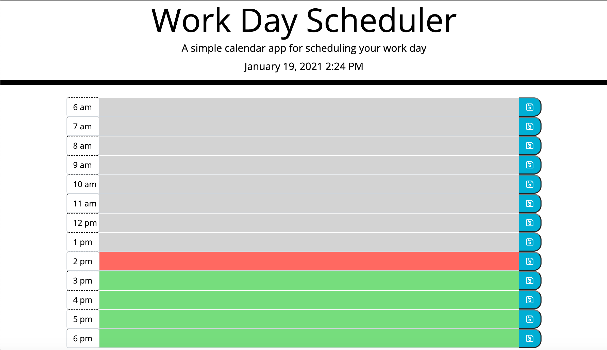
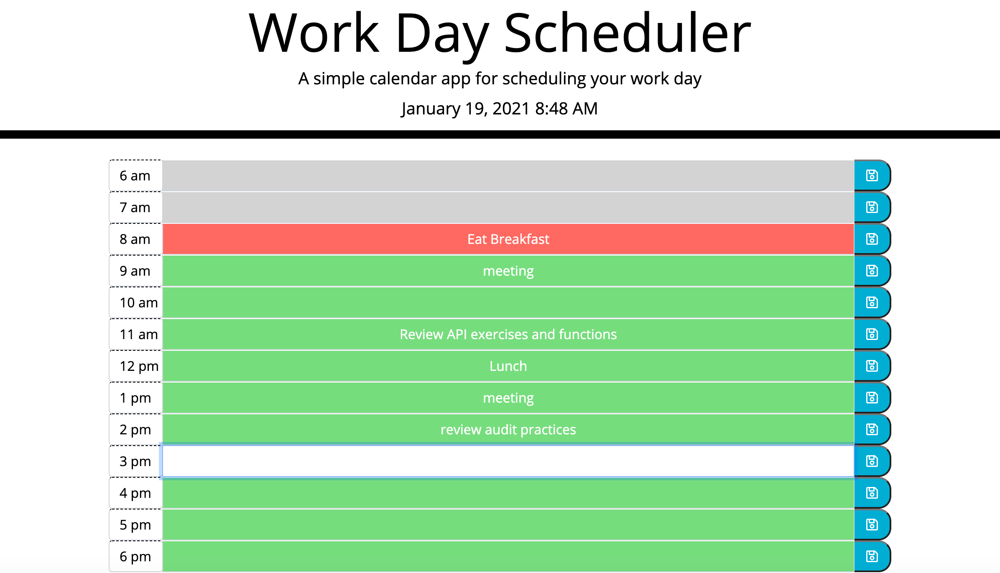
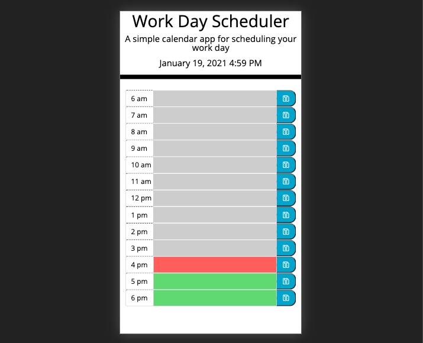

# Workday Scheduler

## Description

A simple calendar application for mapping out your workday.

## Resources and Functionality

This application utilizes HTML, CSS, and is dynamically powerd with jQuery and the Moment.js API. Design resources include: Bootstrap, Google Fonts, and Fontawesome.

Events entered into the input fields are saved into local storage after clicking the save button and will persist until removed by the user. The input field color is determined by time of day and updates at the change of the hour.

## For Development

Currently, to clear a scheduled event, users must click into the event, delete the contents, and save. I would like to incorporate 'clear' buttons on each event and a 'clear all' button at the end of the page to clear the entire schedule at once. I would also like to expand the schedule to 24 hours for those working alternative shifts to the standard business day.

## Screenshots of Application

Users are presented with a simple, clean design that displays well on mobile devices, tablets, and desktops. Schedule is color-coded, with red for present hour, grey for past hours, and green for future hours.

Events entered into the schedule persist after refreshing the browser, or closing and re-opening application.

View of application on i-phone 7/8/9

## Link to Workday Scheduler

[Workday Scheduler](https://jnel-221.github.io/what-a-day/)
